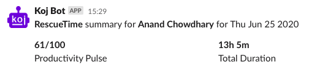

# ⏰ RescueTime Slack

Post your RescueTime daily productivity pulse and hours logged to Slack.

[](https://github.com/AnandChowdhary/rescuetime-slack/actions)
[](https://github.com/AnandChowdhary/rescuetime-slack/blob/master/LICENSE)
[](https://github.com/AnandChowdhary/rescuetime-slack/graphs/contributors)
[](https://denorg.github.io/starter/)
[](https://github.com/AnandChowdhary/rescuetime-slack)
[](https://github.com/semantic-release/semantic-release)



## ⭐ Getting started

The code in [`mod.ts`](./mod.ts) fetches your RescueTime daily statistics and posts it on Slack using a webhook configured in [`rescuetime-slack.yml`](./rescuetime-slack.yml):

```yml
webhook: https://hooks.slack.com/services/$WEBHOOK
apiKeys:
  "U013KLNLY86": "$API_KEY"
```

More people can be added under the `apiKeys` key in the YAML file by adding their Slack user IDs. For each user, `$API_KEY` is replaced by the API key for their name, stored in GitHub Secrets; for example "U013KLNLY86" transforms to `API_KEY_U013KLNLY86` (the name of the environment variable). The `$WEBHOOK` environment variable has the Slack webhook.

Fork this project and update the YAML configuration and GitHub Secrets to get your own bot. You can also customize the bot name and icon in the configuration file (`botName` and `botIcon` respectively).

## 👩‍💻 Automation

A GitHub Actions [workflow](./.github/workflows/deno.yml) runs the following script every day at 8 am UTC to post the message:

```bash
deno run --unstable --allow-net --allow-read --allow-env mod.ts
```

## 📄 License

[MIT](./LICENSE) © [Anand Chowdhary](https://anandchowdhary.com)
